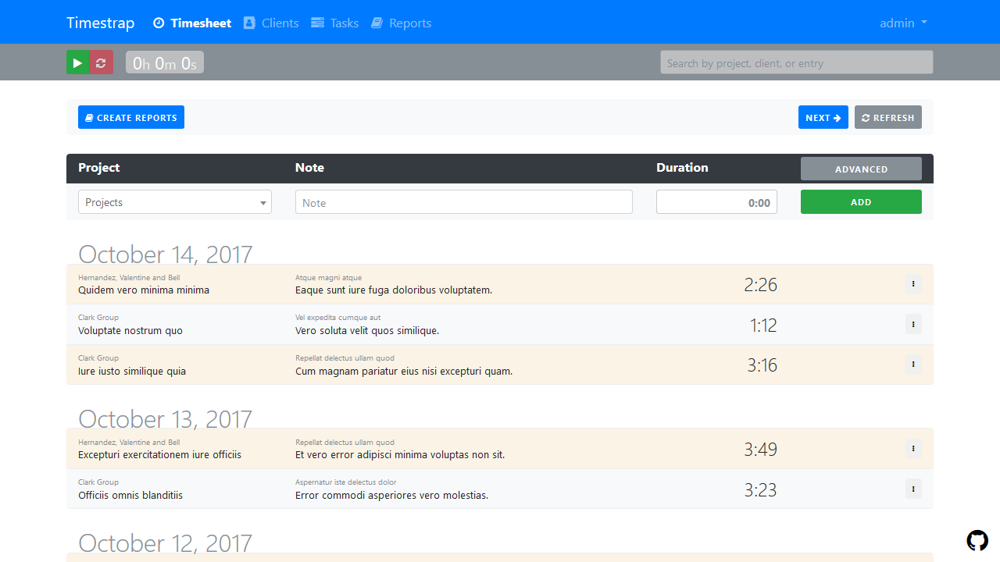

[//]: # (This file is generated by the documentation build process.)
[//]: # (DO NOT modify it directly!)
[//]: # (See gulp configuration and the `docs` folder for more.)

# Timestrap

   

Time tracking and invoicing you can host anywhere. Full export support in
multiple formats and easily extensible.

### :warning: Warning

This app is currently very unstable. Everything may, and probably will, change.

## Demo

There is a [demo instance of Timestrap](https://timestrap.herokuapp.com/) on
Heroku that resets every 10 minutes. The default credentials are:

- Username: `admin`
- Password: `admin`

## Quickstart

Want to get up and running quickly? :rocket:

For manual deployments to Heroku without using the deploy button, make sure to
create two settings before pushing using `heroku config:set`:

    heroku config:set DJANGO_SETTINGS_MODULE=timestrap.settings.heroku
    heroku config:set SECRET_KEY=ChangeMeToSomethingRandom

After a successful push, log in with the default credentials (below)
and **change the admin password**

:lock: Heroku deployments use a default username and password with superuser 
access, please change it via the admin panel after initial login:

- Username: `admin`
- Password: `admin`

## Manual Installation

Follow the steps below to install Timestrap locally or on any server. This 
process installs the minimal requirements to *run* Timestrap. For development
requirements and procedures, see [Development Installation](#development-installation).

1. Install the requirements:
    - Python 2.7+

1. Initiate a virtual environment.

        pip install pipenv && pipenv install

1. Bootstrap the database.

        python manage.py migrate

1. Create the initial site and user (username: admin, password: admin).

        python manage.py createsite

1. Run the server!

        python manage.py runserver

The Timestrap application should now be running at [http://localhost:8000](http://localhost:8000).
If it is not, feel free to [create an issue](https://github.com/overshard/timestrap/issues)
to seek assistance or report a bug! :bug:

## Development Installation

**:exclamation: Important Note:** Node is not required for Timestrap to function. Node is 
used for building Timestrap's static files and improving the development 
workflow. This installation procedure is only necessary for making changes to 
static files.

1. Install the requirements:
    - Python 2.7+
    - Node 6+

1. Initiate a virtual environment with the development requirements.

        pip install pipenv && pipenv install --dev

1. Install Node dependencies.

        npm install -g yarn && yarn install

1. Bootstrap the database.

        gulp migrate

1. Create the initial site and user (username: admin, password: admin).

        gulp createsite

1. Run the server!

        gulp

The Timestrap application should now be running at [http://localhost:8000](http://localhost:8000).
Gulp will automatically recognize and recompile changes to any static
files, allowing quick modification and review without starting and stopping
the application.

[Pull requests](https://github.com/overshard/timestrap/pulls) are :+1: welcome 
and :clap: encouraged!

## Further Reading

For additional documentation on [configuration](https://docs.gettimestrap.com/en/latest/#configuration), 
[installation](https://docs.gettimestrap.com/en/latest/#installation), 
[testing](https://docs.gettimestrap.com/en/latest/development/testing.html) and
more, please see [https://docs.getTimestrap.com](https://docs.gettimestrap.com).
